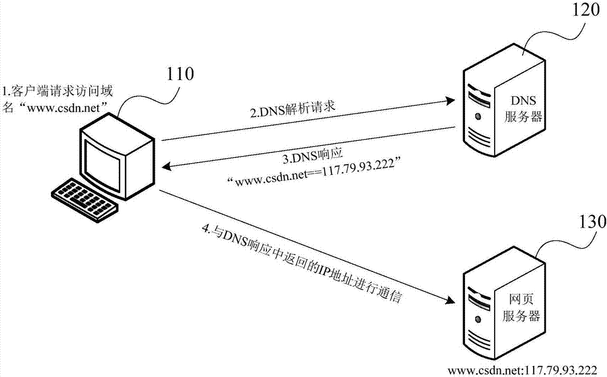

# 6-dns预解析
当浏览网页时，浏览器会在加载网页时对网页中的域名进行解析缓存，这样在单击当前网页中的连接时就无需进行DNS的解析，减少用户等待时间，提高用户体验，目前支持DNS预解析的浏览器有Chrome和FF

使用：
```
<meta http-equiv="x-dns-prefetch-control" content="on" />
<link rel="dns-prefetch" href="http://bdimg.share.baidu.com" />
```



本地DNS缓存查找:浏览器DNS缓存(chrome://net-internals/#dns) -> 本地DNS缓存(chrome://net-internals/#dns) -> host文件

DNS 预解析只对于跨域内容有用，同域的话，解析 Link 标签的时候已经把域名解析成 IP 地址了