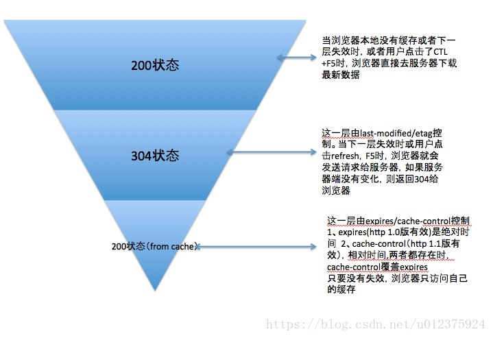

# 8-强缓存和协商缓存
强缓存和协商缓存优先级:强缓存>协商缓存

## 强缓存:
服务器端response header中通过设置的缓存时间来控制文件是否过期,从而去客户端获取并读取缓存文件

### cache-control
- 1. max-age: 设置从服务端获取文件到缓存过期的时间,在这段时间内会自动从浏览器缓存中获取文件
- 2. s-maxage: 设置代理服务的缓存过期时间,不读客户端缓存判断,优先级高于max-age;
- 3. private:即只有某些用户才可缓存该资源,例如客户端本地;
- 4. public:任何情况下都可缓存该资源,例如对于公共访问CDN等缓存设备,设置public可以提高缓存命中率;
- 5. no-chache:跳过强缓存但不妨碍协商缓存;
- 6. no-store:不走任何缓存机制判断;

cache-control属性优先级: no-store > no-cache > s-maxage > max-age 

### Pragma
逐步被弃用,是为了向下兼容,值为no-cache则代表禁用浏览器缓存;

### Expires
GMT时间，表示该缓存的有效时间,来自服务器时间,告诉浏览器可以直接走缓存而不需要请求

强缓存优先级: Pragma > cache-control(HTTP1.1) > Expires(HTTP1.0)

强缓存的缺陷:无法及时感知服务器文件的更新

## 协商缓存:
### last-modified和if-modified-since
服务端在返回资源时，会将该资源的最后更改时间通过Last-Modified字段返回给客户端,再次请求的时候,客户端会先判断缓存信息中有没有目标文件,如果有,则会在请求头中添加if-modified-since,其值为当前读取到的缓存文件中的last-modified,如果发现服务器的文件修改时间等于if-modified-since,则会返回304状态,并从浏览器缓存中进行读取文件,如果发现新于当前文件,则会重新从服务器中获取文件,此时返回状态200

last-modified的缺陷:
- 1.某些服务器无法获取精确的修改时间
- 2.文件内容没有修改,但文件的修改时间变了

### etag和if-none-matched
服务器通过某个算法对资源进行计算，取得一串值(类似于文件的md5值),请求会携带etag进行返回,当再次请求的时候,会判断当前if-none-matched是否匹配服务器当前资源的hash,否则返回最新资源,是则返回304并告诉浏览器读取缓存

协商缓存优先级:  etag > last-modified

